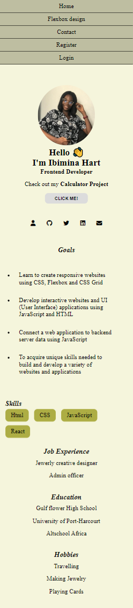
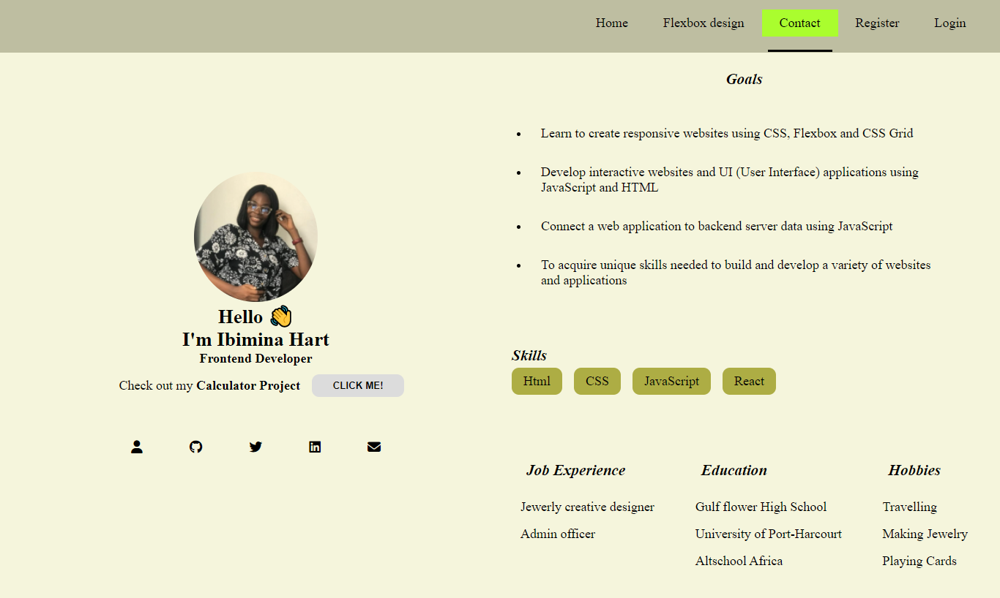

## Table of contents

- [Overview](#overview)
  - [The challenge](#the-challenge)
  - [Screenshot](#screenshot)
  - [Links](#links)
- [My process](#my-process)
  - [Built with](#built-with)
- [Author](#author)

## Overview

### The challenge

Users should be able to:

- View the optimal layout depending on their device's screen size

### Screenshot

### Links

- Solution URL: (https://github.com/ibimina/first-assignment-alt)
- Live Site URL:(https://ibimina.github.io/first-assignment-alt/)

## My process

- Wrote html template
- styled with CSS

### Built with

- HTML5
- CSS custom properties
- Flexbox
- Mobile-first workflow

## Author

- Ibimina Hart

- Frontendmentor -(https://www.frontendmentor.io/ibimina)
- Twitter -(https://www.twitter.com/ibiminaaH)
